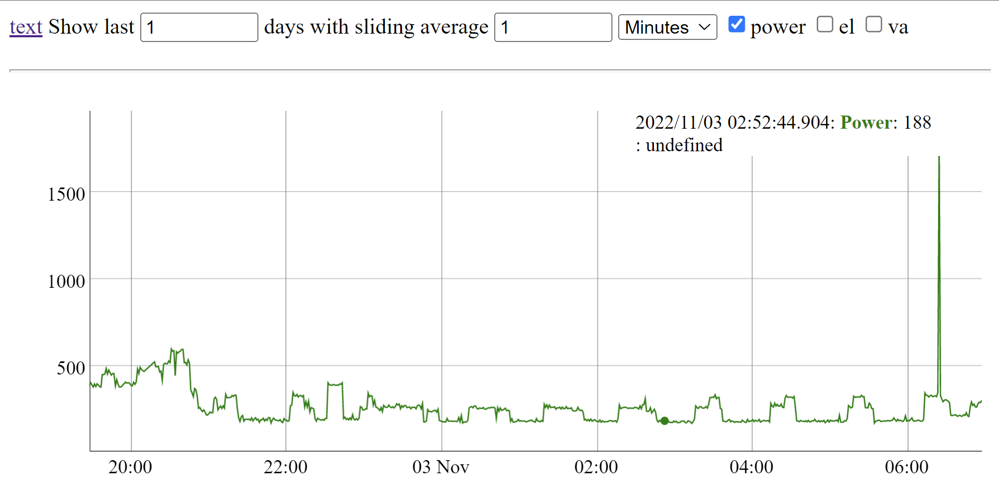
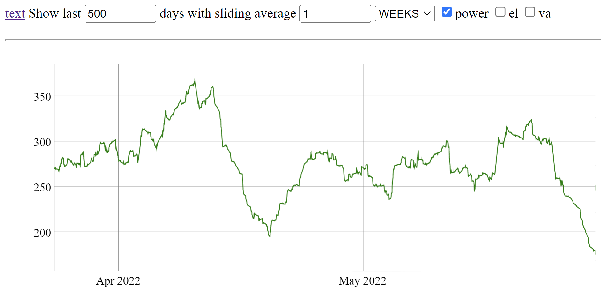

Backend and frontend to obtain measurement information and presenting electricity and water consumption for KTC RCU Lägenhetsnod.
Code is written for KTC RCU1111-1100.

More information here:
https://docs.ktc.se/media/duc-manualer/Anvandarmanual%20del%202,%20KTC-RCU1111,%20SW-4.3.00,%20T-V%202013-08-13.%20Peo%20Sandberg-Sanna%20Fager%20KTC%20TECH.pdf

## Docker compose
- database: Postgres container to store recorded measurements (Postgres)
- measurement-reader: Reader to read and store measurements in database every minute (Java main application)
- frontend: Frontend to present data (Jetty, JSP and dygraph)

## How to run
1. Modify ```ktc_settings.env``` with your KTC settings (IP adress and login password).
2. Configure the volume  _database-data_ used for persisting the postgres database, to suit your needs.
3. Compile and start:
```
./gradlew && docker-compose up --build -d
```

## Screenshots






